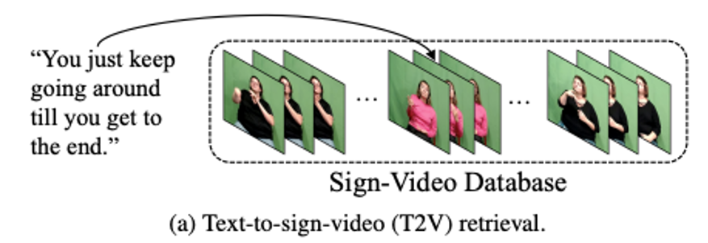
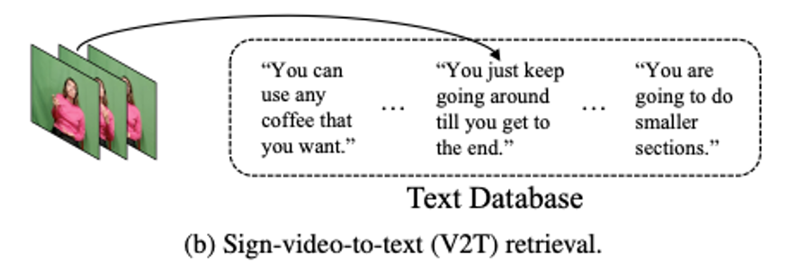
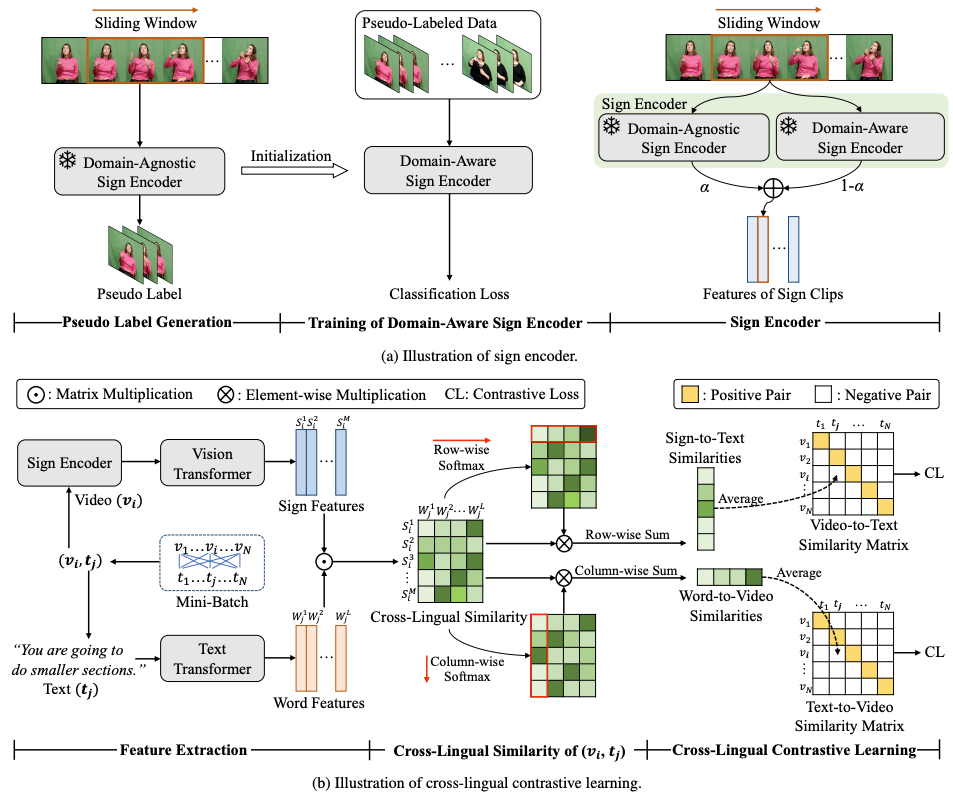

# CiCo
Official Implementations for [CiCo: Domain-Aware Sign Language Retrieval via Cross-Lingual Contrastive Learning, CVPR 2023](https://arxiv.org/pdf/2303.12793.pdf)

## Introduction

<p align="center">
  
  
  <br />
  <em>Illustration of: (a) T2V retrieval; (b) V2T retrieval.</em>
</p>

  <br />


<p align="center">
  
  <br />
  <em>Framework overview.</em>
</p>


This work focuses on sign language retrieval—a recently proposed task for sign language understanding. Sign language retrieval consists of two sub-tasks: text-to-sign-video (T2V) retrieval and sign-video-to-text (V2T) retrieval. Different from traditional video-text retrieval, sign language videos, not only contain visual signals but also carry abundant semantic meanings by themselves due to the fact that sign languages are also natural languages. Considering this character, we formulate sign language retrieval as a cross-lingual retrieval problem as well as a video-text retrieval task. Concretely, we take into account the linguistic properties of both sign languages and natural languages, and simultaneously identify the fine-grained cross-lingual (i.e., sign-to-word) mappings while contrasting the texts and the sign videos in a joint embedding space. This process is termed as cross-lingual contrastive learning. Another challenge is raised by the data scarcity issue—sign language datasets are orders of magnitude smaller in scale than that of speech recognition. We alleviate this issue by adopting a domain-agnostic sign encoder pre-trained on large-scale sign videos into the target domain via pseudo-labeling. Our framework, termed as domain-aware sign language retrieval via Cross-lingual Contrastive learning or CiCo for short, outperforms the pioneering method by large margins on various datasets, e.g., +22.4 T2V and +28.0 V2T R@1 improvements on How2Sign dataset, and +13.7 T2V and +17.1 V2T R@ 1 improvements on PHOENIX-2014T dataset.

## Performance
<table><thead><tr><th rowspan="2">Model</th><th colspan="4">T2V</th><th colspan="4">V2T</th></tr><tr><th>R@1</th><th>R@5</th><th>R@10</th><th>MedR</th><th>R@1</th><th>R@5</th><th>R@10</th><th>MedR</th></tr></thead><tbody><tr><td>How2Sign</td><td>56.6</td><td>69.9</td><td>74.7</td><td>1.0</td><td>51.6</td><td>64.8</td><td>70.1</td><td>1.0</td></tr><tr><td>PHOENIX2014T</td><td>69.5</td><td>86.6</td><td>92.1</td><td>1.0</td><td>70.2</td><td>88.0</td><td>92.8</td><td>1.0</td></tr><tr><td>CSL-Daily</td><td>75.3</td><td>88.2</td><td>91.9</td><td>1.0</td><td>74.7</td><td>89.4</td><td>92.2</td><td>1.0</td></tr></tbody></table>


## Environment
Please install packages by:
```sh
conda create --name yourEnv python=3.7
conda activate yourEnv
conda install --yes -c pytorch pytorch=1.7.1 torchvision cudatoolkit=11.0
pip install ftfy regex tqdm
pip install opencv-python boto3 requests pandas
pip install -r requirements.txt
```
## Data Preparation
**How2Sign**

To use the How2Sign dataset, please download the raw videos it from [link](https://how2sign.github.io/#download)(Green Screen RGB videos (frontal view)). Then re-aglin and crop videos with:
```sh
python data_preparation/reaglined_and_crop.py --video_dir 'path_to_H2S_raw_videos'  --output_dir ./data/How2Sign/processed_videos --split train
python data_preparation/reaglined_and_crop.py --video_dir 'path_to_H2S_raw_videos'  --output_dir ./data/How2Sign/processed_videos --split test
```

**PHOENIX2014T**

To use the PHOENIX2014T dataset, please download it from [here](https://www-i6.informatik.rwth-aachen.de/ftp/pub/rwth-phoenix/2016/phoenix-2014-T.v3.tar.gz). Then prepare the dataset with:
```sh
python data_preparation/gather_frames.py --input_path  'path_to_phoenix_2014T_images' --output_path data/phoenix_2014T
```
**CSL-Daily**

To use the CSL-Daily dataset, please download it from [here](http://home.ustc.edu.cn/~zhouh156/dataset/csl-daily/). Then prepare the dataset with:

```sh
python data_preparation/gather_frames.py --input_path 'path_to_CSL_images' --output_path data/csl-daily
```


## Training

The training of our framework consists of two disjoint parts: (1) training the domain-aware sign encoder for pre-extract vision features of sign-videos; (2) training a cross-lingual contrastive learning (CLCL) module to handling sign language retrieval. The training example is given on our primary focused datset How2Sign.

### Quick start for CLCL training
**Prepare sign features**

Please download the domain-agnostic sign encoder provided by [bslattend](https://arxiv.org/pdf/2103.16481.pdf) from [here](https://www.robots.ox.ac.uk/~vgg/research/bslattend/data/bsl5k.pth.tar), and our pre-trained domain-aware sign encoder from [Google Drive](https://drive.google.com/file/d/1TbX3UjaUvXhsXSQX2UAm81nitt8tsgLq/view?usp=share_link) or [BaiduCloud](https://pan.baidu.com/s/1VnpR7EsKRxuJ5f_m905EWQ)(code:7k6i), and  place them under `I3D_feature_extractor/chpt`. 
Then you can extract features of sign-videos by running following commands:
```sh
cd I3D_feature_extractor
python get_features.py
```

**Train CLCL**
```
cd CLCL
python -m torch.distributed.launch --nproc_per_node=4 main_task_retrieval.py --do_train
```
### Sign encoder training
**Prepare domain-agnostic sign encoder**

Please download the domain-agnostic sign encoder provided by [bslattend](https://arxiv.org/pdf/2103.16481.pdf) from [here](https://www.robots.ox.ac.uk/~vgg/research/bslattend/data/bsl5k.pth.tar) and  place it under `I3D_feature_extractor/chpt`. 

**Generate pseudo label**

You can generate pseudo labels by running following commands:
```
cd I3D_feature_extractor
python get_pseudos.py
```
**Train domain-aware sign dncoder**
```
cd I3D_trainer
python main.py --pretrained ../I3D_feature_extractor/chpt/bsl5k.pth.tar --checkpoint  'path_to_save_checkpoints'
```

Once you have completed the training process, you can proceed with the CLCL training by following the instructions in "Quick start for CLCL training" with the domain-aware sign encoder model that you have acquired.


## Testing

Please download the sign features of sign-videos from [Google Drive](https://drive.google.com/file/d/1Vb-HFZd-rhjN49sB5WwLRpIbyhiC6xTy/view?usp=share_link) or [BaiduCloud](https://pan.baidu.com/s/1m9LlFm7hnFII0rOOzdg14g)(code:l7wc) and place them under `CLCL/sign_features`, download the pre-trained CLCL module checkponit from [Google Drive](https://drive.google.com/file/d/1Hpcn5obCcG5JHa3nLvHqX9pfrp7g6wDu/view?usp=share_link) or [BaiduCloud](https://pan.baidu.com/s/17UoHFmUVayuSjIlgTrRBIw)(code:a0h7) and place it under `CLCL/chpt`.
- How2Sign 
```sh
cd CLCL
python -m torch.distributed.launch --nproc_per_node=1 main_task_retrieval.py --do_eval --init_model chpt/H2S_sota.pth
```
- PHOENIX2014T 
```sh
cd CLCL
python -m torch.distributed.launch --nproc_per_node=1 main_task_retrieval.py --do_eval --init_model chpt/ph_sota.pth --data_path data_ph --alpha 0.9 --datatype ph --features_path sign_feature/ph_domain_agnostic --features_path_retrain sign_feature/ph_domain_aware
```
- CSL-Daily
```sh
cd CLCL
python -m torch.distributed.launch --nproc_per_node=1 main_task_retrieval.py --do_eval --init_model chpt/csl_sota.pth --data_path data_csl --alpha 0.8 --datatype csl --features_path sign_feature/csl_domain_agnostic --features_path_retrain sign_feature/csl_domain_aware
```
## Citations
```
@inproceedings{cheng2023cico,
      title={CiCo: Domain-Aware Sign Language Retrieval via Cross-Lingual Contrastive Learning}, 
      author={Yiting Cheng and Fangyun Wei and Jianmin Bao and Dong Chen and Wenqiang Zhang},
      year={2023},
      booktitle={CVPR},
}
```
## Acknowledgment
This code is based on [CLIP4Clip](https://github.com/ArrowLuo/CLIP4Clip) and [bsl1k](https://github.com/gulvarol/bsl1k).
