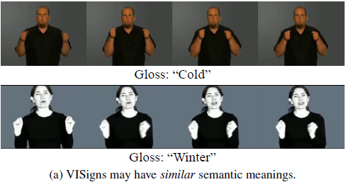
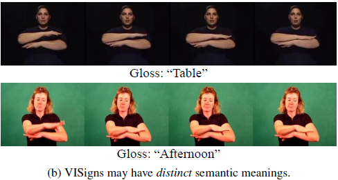
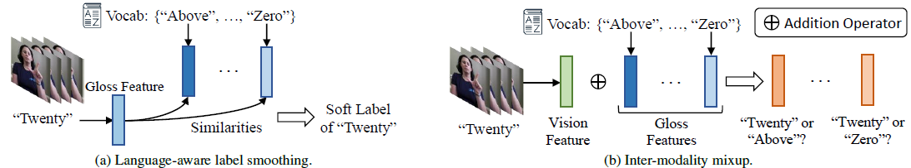

# NLA-SLR
Official Implementations for [Natual Language-Assisted Sign Language Recognition, CVPR 2023]()

## Introduction


There exists a lot of visually indistinguishable signs (VISigns) in current SLR datasets. They can be categorized into two classes: VISigns with similar or distinct semantic meanings. However, purely vision-based neural networks are less effective to recognize these VISigns. To address this issue, we propose the Natural Language-Assisted Sign Language Recognition (NLA-SLR) framework, which exploits semantic information contained in glosses (sign labels). First, for VISigns with similar semantic meanings, we propose language-aware label smoothing by generating soft labels for each training sign whose smoothing weights are computed from the normalized semantic similarities among the glosses to ease training. Second, for VISigns with distinct semantic meanings, we present an inter-modality mixup technique which blends vision and gloss features to further maximize the separability of different signs under the supervision of blended labels.

## Performance and Checkpoints

| Dataset | P-I Top1 | P-I Top5 | P-C Top1 | P-C Top5 | Ckpt | Training |
| :---: | :---: | :---: | :---: | :---: | :---: | :---: |
| WLASL-2000 | 61.26 | 91.77 | 58.31 | 90.91 | [Google]()/[Baidu]() | [config](configs/nla_slr_wlasl_2000.yaml) |
| WLASL-1000 | 75.64 | 94.62 | 75.72 | 94.65 | [Google]()/[Baidu]() | [config](configs/nla_slr_wlasl_1000.yaml) |
| WLASL-300 | 86.98 | 97.60 | 87.33 | 97.81 | [Google]()/[Baidu]() | [config](configs/nla_slr_wlasl_300.yaml) |
| WLASL-100 | 92.64 | 96.90 | 93.08 | 97.17 | [Google]()/[Baidu]() | [config](configs/nla_slr_wlasl_100.yaml) |
| MSASL-1000 | 73.80 | 89.65 | 70.95 | 89.07 | [Google]()/[Baidu]() | [config](configs/nla_slr_msasl_1000.yaml) |
| MSASL-500 | 82.90 | 93.46 | 83.06 | 93.54 | [Google]()/[Baidu]() | [config](configs/nla_slr_msasl_500.yaml) |
| MSASL-200 | 89.48 | 96.69 | 89.86 | 96.93 | [Google]()/[Baidu]() | [config](configs/nla_slr_msasl_200.yaml) |
| MSASL-100 | 91.02 | 97.89 | 91.24 | 98.19 | [Google]()/[Baidu]() | [config](configs/nla_slr_msasl_100.yaml) |
| NMFs-CSL | 83.7 | 98.5 | -- | -- | [Google]()/[Baidu]() | [config](configs/nla_slr_nmf.yaml) |

## Usage
### Environment
It is better to use docker:
```
docker pull rzuo/pose:sing_ISLR
```
You may also install packages by:
```
pip install -r requirements.txt
```

### Data Preparation
**SLR Datasets**

We use three datasets: [WLASL](https://dxli94.github.io/WLASL/), [MSASL](https://www.microsoft.com/en-us/research/project/ms-asl/), and [NMFs-CSL](http://home.ustc.edu.cn/~alexhu/Sources/index.html). Note that all raw videos need to be zipped.

**Word Embeddings**

We use fastText trained on Common Crawl. The pretrained word embeddings can be downloaded from [here](https://dl.fbaipublicfiles.com/fasttext/vectors-english/crawl-300d-2M-subword.zip).

**Keypoints**

We use [HRNet](https://github.com/open-mmlab/mmpose/tree/master/configs/wholebody/2d_kpt_sview_rgb_img/topdown_heatmap/coco-wholebody/hrnet_w48_coco_wholebody_384x288_dark_plus.py) pretrained on COCO-WholeBody. Below is an example of extracting keypoints for the WLASL training set.
```
config_file='configs/nla_slr.yaml'
python -m torch.distributed.launch --nproc_per_node 8 --master_port 29999 --use_env gen_pose.py --config=${config_file} --split=train
```

**S3D K400 pretrained model**

Download S3D pretrained on K400 from [here](https://github.com/kylemin/S3D).
Put it in `../../pretrained_models/s3ds_actioncls_ckpt`

Split files, word embeddings, and keypoints are available at: WLASL ([Google]()/[Baidu]()), MSASL ([Google]()/[Baidu]()), NMFs-CSL ([Google]()/[Baidu]()).


### Training

Video/keypoint encoders (64-frame as an example):
```
config_file='configs/rgb_frame64.yaml'
python -m torch.distributed.launch --nproc_per_node 8 --master_port 29999 --use_env training.py --config ${config_file} 
```
```
config_file='configs/pose_frame64.yaml'
python -m torch.distributed.launch --nproc_per_node 8 --master_port 29999 --use_env training.py --config ${config_file} 
```

VKNet-64/32 (load pretrained video/keypoint encoders)
```
config_file='configs/two_frame64.yaml'
python -m torch.distributed.launch --nproc_per_node 8 --master_port 29999 --use_env training.py --config ${config_file} 
```
```
config_file='configs/two_frame32.yaml'
python -m torch.distributed.launch --nproc_per_node 8 --master_port 29999 --use_env training.py --config ${config_file} 
```

NLA-SLR (load VKNet-64/32)
```
config_file='configs/nla_slr_wlasl_2000.yaml'
python -m torch.distributed.launch --nproc_per_node 8 --master_port 29999 --use_env training.py --config ${config_file} 
```


### Testing
```
config_file='configs/nla_slr_wlasl_2000.yaml'
python -m torch.distributed.launch --nproc_per_node 1 --master_port 29999 --use_env prediction.py --config ${config_file} --eval_setting origin
```
3-crop inference can usually yield better results:
```
config_file='configs/nla_slr_wlasl_2000.yaml'
python -m torch.distributed.launch --nproc_per_node 1 --master_port 29999 --use_env prediction.py --config ${config_file} --eval_setting 3x_pad
```

## Citations
```
@inproceedings{
    zuo2023nla-slr,
    title={Natual Language-Assisted Sign Language Recognition},
    author={Ronglai Zuo and Fangyun Wei and Brian Mak},
    booktitle={CVPR},
    year={2023}
}
```
