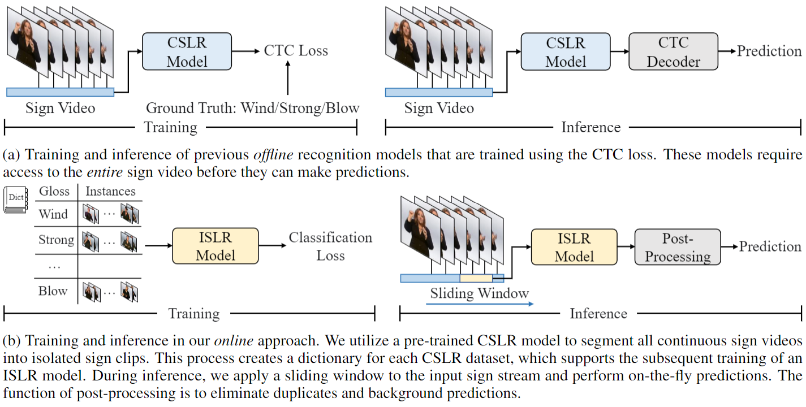

# Towards Online Continuous Sign Language Recognition and Translation
Official implementation for the EMNLP 2024 [paper](https://arxiv.org/pdf/2401.05336v2): Towards Online Continuous Sign Language Recognition and Translation

## Introduction


During inference, typical CTC-based models generally require the entire sign video as input to make predictions, a process known as offline recognition, which suffers from high latency and substantial memory usage. In this work, we take the first step towards online CSLR. Our approach consists of three phases: 1) developing a sign dictionary; 2) training an isolated sign language recognition model on the dictionary; and 3) employing a sliding window approach on the input sign sequence, feeding each sign clip to the optimized model for online recognition. Additionally, our online recognition model can be extended to support online translation by integrating a gloss-to-text network and can enhance the performance of any offline model. 


## Environment
It is better to use docker:
```
docker pull rzuo/pose:sing_ISLR
```
Or you may run 
```
pip install -r requirements.txt
```


## Data Preparation
### CSLR Datasets
We validate our method on [Phoenix-2014](https://www-i6.informatik.rwth-aachen.de/~koller/RWTH-PHOENIX/), [Phoenix-2014T](https://www-i6.informatik.rwth-aachen.de/~koller/RWTH-PHOENIX-2014-T/), and [CSL-Daily](http://home.ustc.edu.cn/~zhouh156/dataset/csl-daily/).
Note that all raw videos need to be zipped.

### Keypoints
The extracted keypoints are the same as those used in [TwoStream-SLR](https://github.com/FangyunWei/SLRT/tree/main/TwoStreamNetwork).

### S3D K400 pretrained model
The S3D pretrained on K400 is avaialble [here](https://github.com/kylemin/S3D).
Put it in ``../pretrained_models/s3ds_actioncls_ckpt``


## Online CSLR Framework
Please check [CSLR/README.md](CSLR/README.md)


## Online SLT
Please check [SLT/README.md](SLT/README.md)


## Boosting an Offline Model with the Online Model
Please check [CTC_fusion/README.md](CTC_fusion/README.md)
