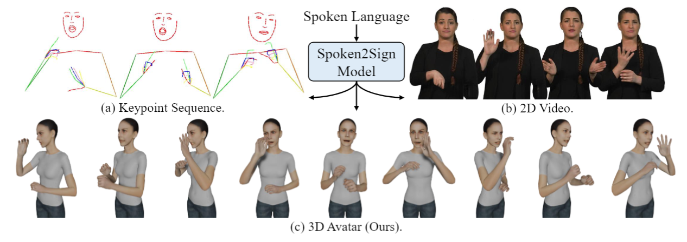

# A Simple Baseline for Spoken Language to Sign Language Translation with 3D Avatars
Official implementation for the ECCV 2024 [paper](https://arxiv.org/pdf/2401.04730.pdf), A Simple Baseline for Spoken Language to Sign Language Translation with 3D Avatars.

## Introduction


The objective of this paper is to develop a functional system for translating spoken languages into sign languages, referred to as Spoken2Sign translation. The Spoken2Sign task is orthogonal and complementary to traditional sign language to spoken language (Sign2Spoken) translation. To enable Spoken2Sign translation, we present a simple baseline consisting of three steps: 1) creating a gloss-video dictionary using existing Sign2Spoken benchmarks; 2) estimating a 3D sign for each sign video in the dictionary; 3) training a Spoken2Sign model, which is composed of a Text2Gloss translator, a sign connector, and a rendering module, with the aid of the yielded gloss-3D sign dictionary. The translation results are then displayed through a sign avatar.


## Environment
Please run 
```
pip install -r requirements.txt
```
Or you may use docker (strongly recommended):
```
sudo docker pull rzuo/pose:sing_ISLR_smplx
sudo docker run --gpus all -v /your_data:/data -v /your_code:/workspace -v /your_models:/pretrained_models --name sing_ISLR_smplx --ipc=host -it rzuo/pose:sing_ISLR_smplx /bin/bash
```


## Data Preparation
### CSLR Datasets
Phoenix-2014T: Please follow https://www-i6.informatik.rwth-aachen.de/~koller/RWTH-PHOENIX-2014-T/.

CSL-Daily: Please follow http://home.ustc.edu.cn/~zhouh156/dataset/csl-daily/.

Note that all raw videos need to be zipped.

### ISLR Datasets
WLASL: Please follow https://dxli94.github.io/WLASL/.

MSASL: Please follow https://www.microsoft.com/en-us/research/project/ms-asl/.

Note that all raw videos need to be zipped.

### Keypoints
We use HRNet pre-trained on COCO-WholeBody. 
Details of the extraction process can be refered to this [work](https://github.com/FangyunWei/SLRT/tree/main/TwoStreamNetwork).

### Segment Isolated Signs
We use a pre-trained CSLR model, TwoStream-SLR, to segment continuous sign videos into a set of isolated sign clips.
The pre-trained model checkpoints can be downloaded [here](https://github.com/FangyunWei/SLRT/blob/main/TwoStreamNetwork/docs/TwoStream-SLR.md).
After that, put the checkpoints into the folder data/results.
Then run
```
python gen_segment.py
```
The segmented signs for Phoenix-2014T and CSL-Daily can be downloaded [here](https://hkustconnect-my.sharepoint.com/:f:/g/personal/rzuo_connect_ust_hk/EqKithWT0etPugjK9cG9qBAB7jxeumx42O8JL3OHgxUCMA?e=SYXbYT).

### SMPL-X Model
Please download the models (mano, smpl, smplh, and smplx) from [here](https://hkustconnect-my.sharepoint.com/:f:/g/personal/rzuo_connect_ust_hk/EqTk_-iniVJPiy1lqKl8LpIBCMA7peNOZbmu4Po4D0UQLg?e=BiLdHv) and unzip them into ../../data/models. The structure should be ../../data/mano, ../../data/smpl, and so on.

### SMPL-X Blender Add-on
Rendering 3D avatars relies on [Blender](https://www.blender.org/download/) (you don't need to download it if you use my docker image) and [SMPL-X add-on](https://smpl-x.is.tue.mpg.de/download.php).
Related add-ons are avaialble [here](https://hkustconnect-my.sharepoint.com/:f:/g/personal/rzuo_connect_ust_hk/EowLQ129uu1Oj3YOtwmb85YBEQjrxnFS97mB9e8fzUTZRw?e=ZRzzap).
Please put the them into ../../pretrained_models/. 

### 3D Dictionary and Video IDs
You can download the estimated 3D dictionary ([link](https://hkustconnect-my.sharepoint.com/:f:/g/personal/rzuo_connect_ust_hk/ElzHt-8ILItGiieh8mr6KtcBDtjMRSYB037h0hvN-K0uqQ?e=ICFhQm)) and video IDs ([link](https://hkustconnect-my.sharepoint.com/:f:/g/personal/rzuo_connect_ust_hk/EtQfT9E5fb5AsrnWgRZc6fsBth_-Mh63rMc45T1GxAbFAA?e=doHGss)).


## Training
### 3D Sign Estimation 
To fit videos to the SMPL-X model, run:
```
python -m torch.distributed.launch --nproc_per_node 8 --master_port 29999 --use_env smplifyx/main.py --config=cfg_files/fit_smplsignx_phoenix.yaml --init_idx=0 --num_per_proc=1500
```

### Text2Gloss Translator
It is based on the gloss2text part of [TwoStream-SLT](https://github.com/FangyunWei/SLRT/tree/main/TwoStreamNetwork).
```
cd text2gloss
config_file='configs/T2G.yaml'
python -m torch.distributed.launch --nproc_per_node 8 --master_port 29999 --use_env training.py --config=${config_file}
```
Then save the T2G predictions:
```
python prediction.py --config=${config_file}
```

### Sign Retrieval
To assign a confidence score to each 3D sign, we follow a model-based design: we first train an isolated sign language recognition model taking synthesized 2D keypoints as inputs, and then select the sign with the highest probability as the representative sign for a target gloss. Training details can be found in this [repo](https://github.com/FangyunWei/SLRT/tree/main/NLA-SLR).

### Sign Connector
To train the sign connector, please run:
```
python make_connector_dataset.py && python smplifyx/sign_connector_train.py
```

## Spoken2Sign Translation
First run prediction.py for the text2gloss translator to store gloss predictions on the dev and test sets:
```
python text2gloss/prediction.py --config=text2gloss/configs/T2G.yaml
```

Then achieve spoken2sign translation by running:
```
python motion_gen.py --config cfg_files/fit_smplsignx.yaml --num_per_proc=1
```
The above command would generate a sequence of motions represented by SMPL-X parameters. "num_per_proc" denotes the number of videos you want to generate.

To further visualize the motions as avatars, please run:
```
conda create --name blender python=3.10 && conda activate blender && pip install bpy==3.4.0 --user && pip install tqdm --user && pip install ConfigArgParse --user && pip install PyYAML --user
python render_avatar.py --config=cfg_files/fit_smplsignx.yaml --num_per_proc=1
```


## Evaluation
### Synthesize 2D Keypoints
The back-translation is based on projected 2D keypoints for a fair comparison with previous works:
```
python smplx2kps.py --config cfg_files/fit_smplsignx_phoenix.yaml
```

### Back-Translation
Just train a sign language translation model (keypoint-only) taking synthesized 2D keypoints as inputs. More details can be found in this [repo](https://github.com/FangyunWei/SLRT/tree/main/TwoStreamNetwork).