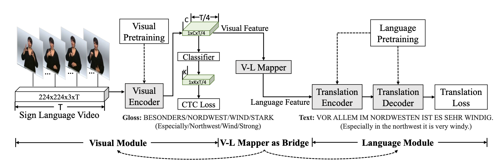
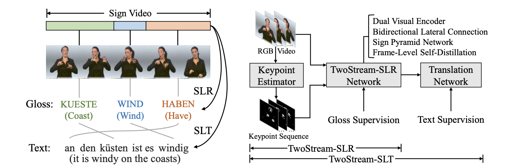

# TwoStreamSLT
A TwoStream network for sign language recognition and translation, including official implementations for 
* [A Simple Multi-modality Transfer Learning Baseline for Sign Language Translation, CVPR2022](https://arxiv.org/abs/2203.04287)
* [Two-Stream Network for Sign Language Recognition and Translation, NeurIPS2022](https://arxiv.org/abs/2211.01367).

## Introduction
Sign Language Translation (SLT) and Sign Language Recognition (SLR) suffer from data scarcity. To mitigate this problem, we first propose [a simple multi-modality transfer learning baseline for SLT](https://arxiv.org/abs/2203.04287), which leverages extra supervision from large-scale general-domain datasets by progressively pretraining modules from general domains to within domains, and finally conducting multi-modal joint training. This simple yet effective baseline achieves strong translation performance, significantly improving over previous works. 



We further propose a [twostream network for SLR and SLT](https://arxiv.org/abs/2211.01367), which incorporates domain knowledge of human keypoints into the visual encoder. The TwoStream network obtains SOTA performances across SLR and SLT benchmarks (`18.8 WER on Phoenix-2014 and 19.3 WER on Phoenix-2014T, 29.0 BLEU4 on Phoenix-2014T, and 25.8 BLEU4 on CSL-Daily`).



## Performance

**SingleStream-SLT (The simple multi-modality transfer learning baseline for SLT)**
| Dataset | R | B1 | B2 | B3 | B4 | Model | Training |
| :---: | :---: | :---: | :---: | :---: | :---: | :---: | :---: |
| Phoenix-2014T | 53.08 | 54.48 | 41.93 | 33.97 | 28.57 | [ckpt](https://hkustconnect-my.sharepoint.com/:f:/g/personal/rzuo_connect_ust_hk/EkpQzXWBrWxDruz6-U-V0kUBgit2vXsc40wLipV8YPLXaQ?e=Bru3oz) | [config](experiments/configs/SingleStream/phoenix-2014t_s2t.yaml) |
| CSL-Daily | 53.35 | 53.53 | 40.68 | 31.04 | 24.09 |[ckpt](https://hkustconnect-my.sharepoint.com/:f:/g/personal/rzuo_connect_ust_hk/EudFBd-IzWJOngYdXVxox6kBI7ASATileGu8ncW-dBDi-w?e=YvKAKm) | [config](experiments/configs/SingleStream/csl-daily_s2t.yaml) |

**Twostream-SLR**
| Dataset | WER | Model | Training |
| :---: | :---: | :---: | :---: | 
| Phoenix-2014 | 18.8 | [ckpt](https://hkustconnect-my.sharepoint.com/:f:/g/personal/rzuo_connect_ust_hk/Ek82sSjQiItKtztuEtpwWSMBnbIq4AJf_lEWNa3sOAT6Fg?e=JXMUgQ) | [config](experiments/configs/TwoStream/phoenix-2014_s2g.yaml) |
| Phoenix-2014T | 19.3 | [ckpt](https://hkustconnect-my.sharepoint.com/:f:/g/personal/rzuo_connect_ust_hk/EtMUEBGyQ-1PkVh85I_I-MoBwpJaifdKrt0b9cHrXUHzSw?e=v1y7hQ) | [config](experiments/configs/TwoStream/phoenix-2014t_s2g.yaml) |
| CSL-Daily | 25.3 | [ckpt](https://hkustconnect-my.sharepoint.com/:f:/g/personal/rzuo_connect_ust_hk/Ev9XdwEfIg9CqINHeNC2K0kB2-buEGf_Ef1yZoF2pKlT5w?e=dBx5gG) | [config](experiments/configs/TwoStream/csl-daily_s2g.yaml) |

**Twostream-SLT**
| Dataset | R | B1 | B2 | B3 | B4 | Model | Training |
| :---: | :---: | :---: | :---: | :---: | :---: | :---: | :---: |
| Phoenix-2014T | 53.48 | 54.90 | 42.43 | 34.46 | 28.95 | [video](https://hkustconnect-my.sharepoint.com/:f:/g/personal/rzuo_connect_ust_hk/EphztyWWWudGjNoPugO53MYBNuv7FUATs1gpUufdtgrAow?e=J28eLg)/[keypoint](https://hkustconnect-my.sharepoint.com/:f:/g/personal/rzuo_connect_ust_hk/Eq34FYe33qlKpxWGM089rq8BFDM_hkd7b8ewgpg1RTpb9Q?e=dVw8LZ)/[joint](https://hkustconnect-my.sharepoint.com/:f:/g/personal/rzuo_connect_ust_hk/Et0ZNVTztKFEqpbOjotlfx4BtiIykhw27U6zQ3LQAJiRkQ?e=sgpB1q) | [config](experiments/configs/TwoStream/phoenix-2014t_s2t_ensemble.yaml) |
| CSL-Daily | 55.72 | 55.44 | 42.59 | 32.87 | 25.79 | [video](https://hkustconnect-my.sharepoint.com/:f:/g/personal/rzuo_connect_ust_hk/EmSUuTojKAZIpy90aA75s00BBOrlZyhkvFBNsbibtgx5mg?e=0MPPEn)/[keypoint](https://hkustconnect-my.sharepoint.com/:f:/g/personal/rzuo_connect_ust_hk/EuZpa5hRV6tMvRFWngg86VUBi01T5GpQ5fkIfKHh571dbw?e=HRTaEG)/[joint](https://hkustconnect-my.sharepoint.com/:f:/g/personal/rzuo_connect_ust_hk/EvAcRN1wDg5JmwdcojaGICMByzgNgq7CJFOqVTXQgV8Rrg?e=46Em1S) | [config](experiments/configs/TwoStream/csl-daily_s2t_ensemble.yaml) |

## Usage
### Prerequisites
Create an environment and install dependencies.
```
conda env create -f environment.yml
conda activate slt
```
### Download
You can run [download.sh](download.sh) which automatically downloads datasets (except CSL-Daily, whose downloading needs an agreement submission), pretrained models, keypoints and place them under corresponding locations. Or you can download these files separately as follows.

**Datasets**

Download datasets from their websites and place them under the corresponding directories in data/
* [Phoenix-2014](https://www-i6.informatik.rwth-aachen.de/~koller/RWTH-PHOENIX/)
* [Phoenix-2014T](https://www-i6.informatik.rwth-aachen.de/~koller/RWTH-PHOENIX-2014-T/)
* [CSL-Daily](http://home.ustc.edu.cn/~zhouh156/dataset/csl-daily/)

Then run [preprocess/preprocess_video.sh](preprocess/preprocess_video.sh) to extract the downloaded videos. 

**Pretrained Models**
We provide pretrained models [here](https://hkustconnect-my.sharepoint.com/:f:/g/personal/rzuo_connect_ust_hk/EolDU7j15xROncGg8QqLpkABn9mFEfriS0owcyr048nyXg?e=jHdxlg). Download this directory and place it as *pretrained_models*. Specifically, the required pretrained models include:
* *s3ds_actioncls_ckpt*: S3D backbone pretrained on Kinetics-400. (From [https://github.com/kylemin/S3D](https://github.com/kylemin/S3D). Thanks for their implementation!)
* *s3ds_glosscls_ckpt*: S3D backbone pretrained on Kinetics-400 and WLASL.
* *mbart_de* / *mbart_zh* : pretrained language models used to initialize the translation network for German and Chinese, with weights from [mbart-cc-25](https://huggingface.co/facebook/mbart-large-cc25). We prune mbart's original word embedding by preserving only German or Chinese tokens to avoid GPU out-of-memory. We also compute gloss embeddings by averaging mBart-pretrained embeddings of all sub-tokens of the gloss. (See [utils/prune_embedding.ipynb](utils/prune_embedding.ipynb))

**Keypoints** (Only needed in TwoStream)
We provide human keypoints for three datasets, [Phoenix-2014](https://hkustconnect-my.sharepoint.com/:u:/g/personal/rzuo_connect_ust_hk/EX4hzndQCiNGlZTlQymJlKgB9l3tBHi2ihKh0b1nrO-4Lg?e=QXUrrP), [Phoenix-2014T](https://hkustconnect-my.sharepoint.com/:u:/g/personal/rzuo_connect_ust_hk/EdCvVpXswSJKlj4FUYUJJ9EBm1cqFBOBMloVRqSTpng7dQ?e=EH6YfR), and [CSL-Daily](https://hkustconnect-my.sharepoint.com/:u:/g/personal/rzuo_connect_ust_hk/Eanp_XYZnmVNiqRlNIQJf6kBkIDst176O2vkPNZDGnmbWw?e=0P8aiq), pre-extracted by HRNet. Please download them and place them under *data/phoenix-2014t(phoenix-2014 or csl-daily)*.


### Training and Evaluation

* For **SingleStream-SLT Baseline**, please see [SingleStream-SLT.md](docs/SingleStream-SLT.md).
* For **TwoStream-SLR**, please see [TwoStream-SLR.md](docs/TwoStream-SLR.md).
* For **TwoStream-SLT**, please see [TwoStream-SLT.md](docs/TwoStream-SLT.md). (Based on TwoStream-SLR)

## Citations
```
@article{chen2022two,
title={Two-Stream Network for Sign Language Recognition and Translation},
  author={Chen, Yutong and Zuo, Ronglai and Wei, Fangyun and Wu, Yu and Liu, Shujie and Mak, Brian},
  journal={NeurIPS},
  year={2022}
}

@InProceedings{
    Chen_2022_CVPR,
    author    = {Chen, Yutong and Wei, Fangyun and Sun, Xiao and Wu, Zhirong and Lin, Stephen},
    title     = {A Simple Multi-Modality Transfer Learning Baseline for Sign Language Translation},
    booktitle = {Proceedings of the IEEE/CVF Conference on Computer Vision and Pattern Recognition (CVPR)},
    month     = {June},
    year      = {2022},
    pages     = {5120-5130}
}
```

